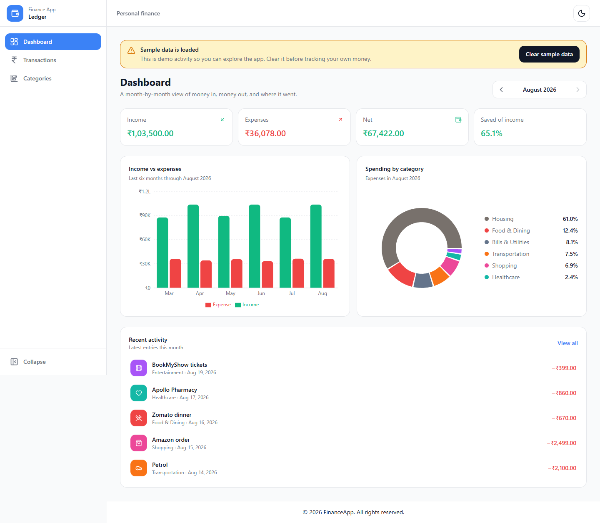
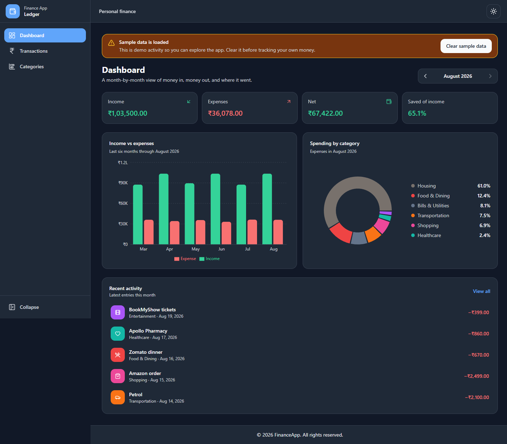
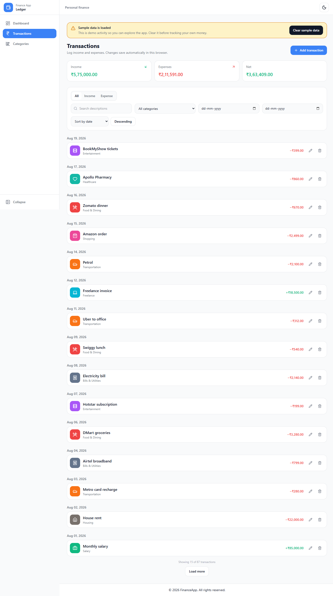
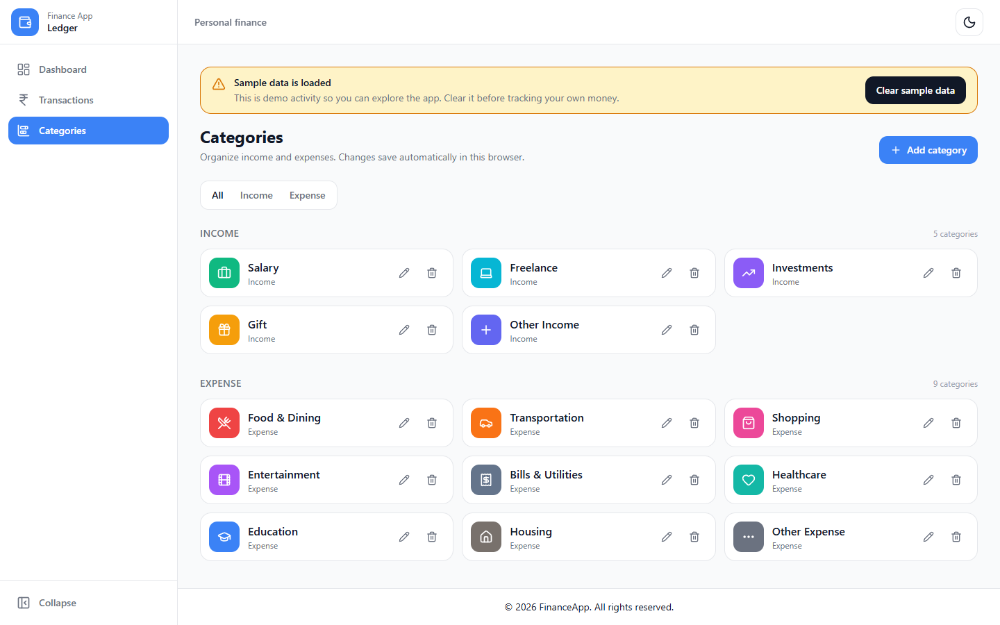
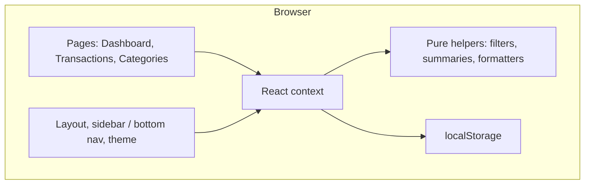

# Personal Finance Tracker

A **client-side** web app for tracking income and expenses. Browse a monthly dashboard, manage a transaction ledger, and organize custom categories — all stored in the browser.

Data never leaves your device. There is no backend, database, or account system.

```bash
git clone https://github.com/portfolio-projects-ajay-parhar/personal-finance-tracker.git
cd personal-finance-tracker
npm install
npm run dev
```

Open the URL Vite prints (usually `http://localhost:5173`).

---

## Problem

Spreadsheets and full banking apps are either too heavy or too invasive for a simple question: **where did this month’s money go?**

This project is a lightweight ledger you can run locally. It is meant for:

- Seeing income vs expenses and a savings rate for a chosen month
- Filtering and editing a transaction list without a signup
- Trying a finance UI with sample data, then switching to your own entries

It is **not** a bank connection, budget planner, or multi-device sync product. Those belong in later work (see [Future improvements](#future-improvements)).

---

## Features

- **Dashboard** — Month picker with income, expenses, net, and savings rate. A six-month income vs expense bar chart, an expense-category pie chart, and recent activity for that month.
- **Transactions** — Add, edit, and delete income or expense entries. Filter by type, category, date range, and description; sort by date, amount, or description. Date-sorted rows group by day. The list loads in pages of 15.
- **Categories** — Default income and expense categories plus custom ones (name, color, icon). Names must be unique per type. Categories in use cannot be deleted until those transactions are reassigned.
- **Demo ledger** — The first visit seeds sample transactions so charts and lists are populated. A banner lets you clear the sample data without removing anything you added.
- **Light / dark theme** — Preference is saved locally.
- **Responsive layout** — Sidebar on desktop, bottom navigation on small screens.

---

## Screenshots

Dashboard (light)



Dashboard (dark)



Transactions



Categories



---

## Demo

There is no hosted demo URL yet. The in-app demo is the seeded ledger:

1. Run `npm run dev` and open the app in a browser.
2. The first visit writes sample transactions (salary, rent, groceries, and similar) spanning recent months so the dashboard is not empty.
3. Use **Clear sample data** on the banner when you want a blank ledger. Your own transactions stay; the sample set will not be seeded again on that origin.

To reset everything, clear site data for this origin in the browser (that also removes theme and sidebar preferences).

---

## Tech stack

| Area | Choice |
| --- | --- |
| UI | React 19, TypeScript, Vite 8 |
| Routing | React Router 7 |
| Styling | Tailwind CSS 4, CSS custom properties for theme tokens |
| Charts | Recharts |
| Forms | React Hook Form, Zod, `@hookform/resolvers` |
| Dates / IDs | date-fns, uuid |
| Icons | lucide-react |
| Persistence | `localStorage` |
| Quality | ESLint, Prettier, `tsc -b` on production build |

State lives in React context (`ThemeProvider`, `CategoryProvider`, `TransactionProvider`). There is no Redux, React Query, or server cache.

---

## Architecture

The app is a static SPA. The browser is the runtime, storage, and “API.”



**Request flow (example: add a transaction)**

1. `TransactionModal` validates with Zod before submit.
2. `TransactionProvider.addTransaction` re-checks amount, date, description, and that the category exists and matches income/expense.
3. A UUID is assigned; the array is written with `saveTransactions`.
4. Dashboard and ledger both read from the same context, so charts update without a network round trip.

**Folder layout**

```
src/
  pages/           Dashboard, Transactions, Categories
  components/      Layout, charts, modals, shared UI
  context/         Theme, categories, transactions
  data/            Default categories, icons, mock ledger
  utils/           Storage, filters, formatters, dashboard stats
  types/           Shared TypeScript types
```

---

## Data model

There is no SQL or ORM. Records are JSON arrays in `localStorage`.

### `Category`

| Field | Type | Notes |
| --- | --- | --- |
| `id` | string | Stable for defaults (`income-salary`, …); UUID for custom categories |
| `name` | string | Unique per `type` (case-insensitive) |
| `type` | `"income"` \| `"expense"` | Restricts which transactions can use it |
| `color` | string | Hex used on charts and badges |
| `icon` | string | lucide icon name |

### `Transaction`

| Field | Type | Notes |
| --- | --- | --- |
| `id` | string | UUID |
| `amount` | number | Positive; stored with two decimal places |
| `description` | string | Required |
| `categoryId` | string | Must exist and match `type` |
| `type` | `"income"` \| `"expense"` | |
| `date` | string | `YYYY-MM-DD` |
| `createdAt` | string | ISO timestamp; used as a tie-breaker when sorting |

Relationship: many transactions → one category (`categoryId`). Deleting a category is blocked while any transaction still points at it.

### Storage keys

| Key | Purpose |
| --- | --- |
| `finance_tracker_transactions` | Transaction list |
| `finance_tracker_categories` | Category list |
| `finance_tracker_theme` | Light or dark |
| `finance_tracker_sidebar_collapsed` | Sidebar state |
| `finance_tracker_mock_seeded` | Whether demo transactions have already been seeded |

Default categories are written on first load so IDs stay stable across reloads.

---

## Authentication and privacy

There is **no login**. That is intentional for this version:

- No passwords, tokens, or session cookies to store or leak
- No personal finance data sent to a server
- Isolation is the browser origin: another site cannot read this `localStorage`

Anyone with access to the same browser profile can open the app and see the ledger. That is the same trust model as a local notes app, not a bank.

A future multi-device version would need accounts, HTTPS, and a real store — see [Future improvements](#future-improvements).

---

## Security considerations

Honest scope: this is a **trusted local UI**, not a multi-tenant backend.

- **No remote API** — nothing to authenticate, rate-limit, or CSRF-protect.
- **XSS** — React’s default escaping covers user-entered descriptions and names. Amounts are parsed as numbers, not rendered as HTML.
- **Validation** — Zod on forms; context-layer checks so invalid category/type pairs never persist.
- **`localStorage`** — readable via DevTools on this origin; not encrypted. Do not treat this as a vault for sensitive bank details.
- **Quota** — very large ledgers can hit the origin storage cap; writes are try/catch’d so a full store does not crash the tab silently without a console error.
- **Dependencies** — production build is static JS/CSS; keep `npm audit` in mind before publishing.

---

## Testing and quality

There is **no unit/E2E test runner** in the repo yet. Current gates:

```bash
npm run lint
npm run format:check
npm run build      # TypeScript project build + Vite production bundle
npm run preview    # serve the production build
```

Logic that is already isolated for tests later: `transactionFilters`, `dashboardStats`, storage helpers, and context validation.

---

## Performance

All work happens on the main thread in one tab.

- Dashboard summaries, six-month trends, and category breakdowns are memoized from the current month’s slice of the ledger.
- Transaction filters/sorts are pure functions over in-memory arrays (fine for typical personal use; not a warehouse).
- The ledger UI shows 15 rows at a time and loads more on demand.
- Charts are Recharts SVGs; they re-render when month or data changes.

If the ledger grew into thousands of rows, next steps would be virtualized lists and/or IndexedDB — not a REST cache.

---

## Deployment

The production artifact is a **static site**: `index.html` plus hashed JS/CSS from `npm run build` (`dist/`).

```
Browser  →  any static host (GitHub Pages, Netlify, Vercel, S3+CDN)
                └── dist/
```

No Node server, reverse proxy, or database is required. Set the Vite `base` option if you deploy under a subpath (for example GitHub Pages project sites).

---

## Getting started

Requires [Node.js](https://nodejs.org/) 20 or later.

```bash
npm install
npm run dev
```

| Script | Purpose |
| --- | --- |
| `npm run dev` | Vite dev server |
| `npm run build` | Typecheck and production bundle |
| `npm run preview` | Serve `dist/` |
| `npm run lint` | ESLint |
| `npm run format` | Prettier write |

---

## What I learned

- **Context + `localStorage` as a full data layer** — CRUD, referential rules (category in use), and demo seeding without a backend.
- **Keeping derived UI cheap** — month slices, `useMemo`, and shared filter/summary helpers so dashboard and ledger stay consistent.
- **Forms in two layers** — Zod for field errors in the modal; the same business rules again in context so invalid data cannot be written even if the form is bypassed.
- **First-run UX** — seeding a realistic ledger, then making it obvious (and reversible) so a portfolio visitor is not looking at empty charts.
- **Theming without a design system package** — CSS variables on `:root` / `.dark`, Tailwind for layout, and chart colors that follow the theme.

---

## Future improvements

- Hosted live demo (static deploy of `dist/`)
- Unit tests for filters, stats, and storage; Playwright coverage for add/edit/delete
- JSON or CSV export/import so data can leave the browser on purpose
- IndexedDB (or a backend) if ledgers grow or sync is required
- Budgets, recurring transactions, and month-over-month insights
- Optional accounts only if multi-device sync is actually needed

---

## License

Private / personal project. Not licensed for reuse unless you add a license file.
